# Fraudulent Bitcoin Transaction Detection Using Graph Machine Learning

## Objective
This project leverages Graph Machine Learning techniques to detect fraudulent Bitcoin transactions. It utilizes the GraphSAGE algorithm to identify illicit activity in a transaction network.

---

## Core Workflow

1. **Data Preprocessing**:
   - Combine transaction and feature datasets to construct a directed graph where nodes represent transactions and edges represent transaction relationships.
   - Normalize features to standardize the data for machine learning.

2. **Graph Construction**:
   - Nodes: Represent individual Bitcoin transactions.
   - Edges: Represent directed relationships between transactions.
   - Features: Each node contains 165 features (e.g., transaction value, time, and other graph-theoretic metrics).

3. **GraphSAGE Algorithm**:
   - **Idea**: Aggregate features from neighboring nodes to learn embeddings for each node.
   - **Steps**:
     - Sample neighbors for each node.
     - Aggregate features of sampled neighbors.
     - Combine aggregated features with the node's own features.
   - **Training**: Use labeled nodes (licit or illicit) to train the model and optimize the embeddings.
   - **Output**: Trained embeddings that encode structural and feature information, aiding in transaction classification.

---

## Key Algorithmic Steps

### 1. Graph Construction
   - Read transaction and edge data.
   - Build a graph using NetworkX, where:
     - Nodes are transaction IDs.
     - Edges define relationships between transactions.

   ```python
   import networkx as nx

   edges_df = pd.read_csv('elliptic_txs_edgelist.csv')
   G = nx.from_pandas_edgelist(edges_df, source='txId1', target='txId2')
   ```

   **Visualization of illicit**:
   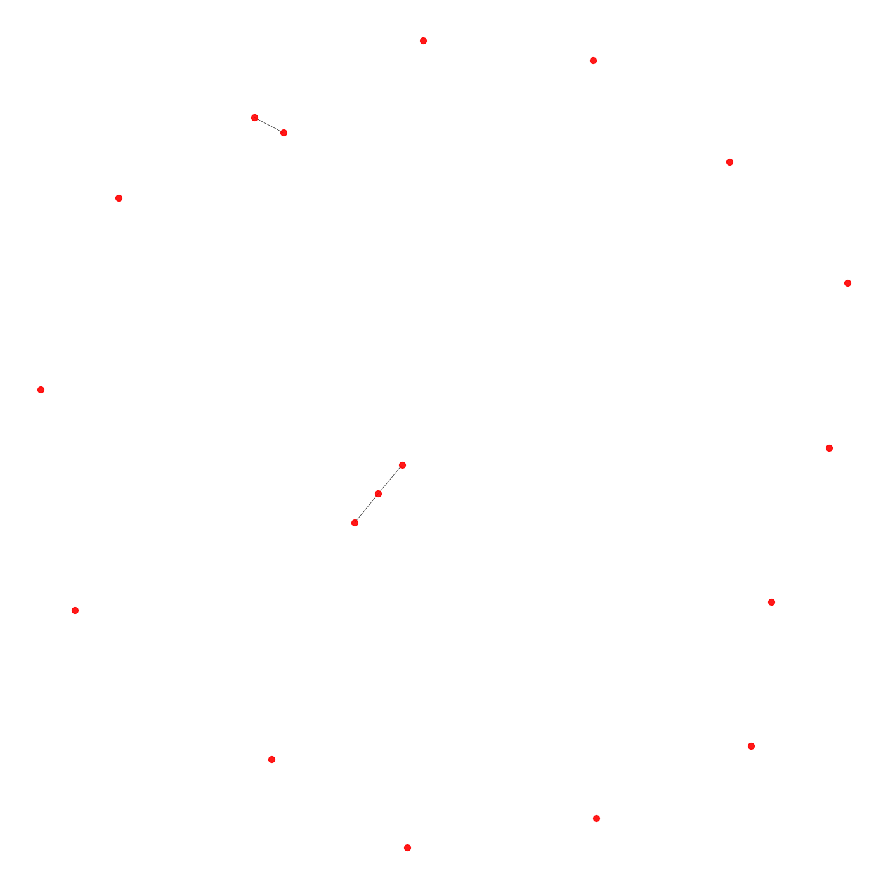
   **Visualization of licit**:
   
   **Visualization of both**:
   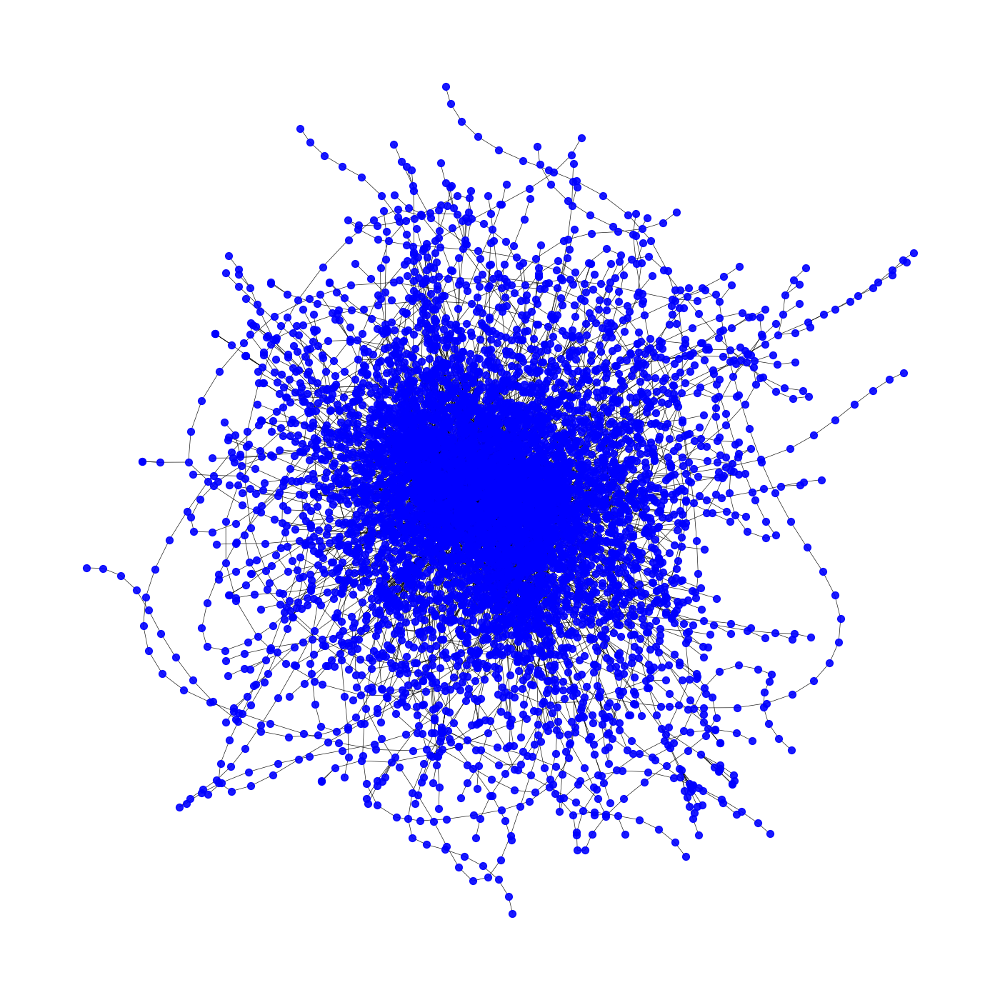

---

### 2. Feature Aggregation
GraphSAGE generates embeddings by aggregating node features and those of their neighbors. The model uses the following workflow:
   - **Layer 1**: Aggregate features from immediate neighbors.
   - **Layer 2**: Aggregate features from the neighbors' neighbors.
   - **Combine**: Combine aggregated features to create final embeddings.

   **Formula**:
   \[
   h_v^{(k)} = \sigma(W^{(k)} \cdot 	ext{AGGREGATE}(\{ h_u^{(k-1)}, orall u \in \mathcal{N}(v) \}))
   \]
   Where:
   - \( h_v^{(k)} \) is the embedding of node \( v \) at layer \( k \).
   - \( \mathcal{N}(v) \) represents the neighbors of node \( v \).
   - \( \sigma \) is a non-linear activation function.
   - \( W^{(k)} \) are trainable weights at layer \( k \).

   **Code Example**:
   ```python
   import torch
   import torch.nn as nn
   from torch_geometric.nn import SAGEConv

   class GraphSAGENet(nn.Module):
       def __init__(self, input_dim, hidden_dim, output_dim):
           super(GraphSAGENet, self).__init__()
           self.conv1 = SAGEConv(input_dim, hidden_dim)
           self.conv2 = SAGEConv(hidden_dim, output_dim)

       def forward(self, x, edge_index):
           x = self.conv1(x, edge_index)
           x = torch.relu(x)
           x = self.conv2(x, edge_index)
           return x
   ```

---

### 3. Model Training
   - **Objective**: Classify nodes into licit or illicit using embeddings.
   - **Loss Function**: Binary Cross-Entropy (BCE).
   - **Optimizer**: Adam.
   - **Training Data**: Split labeled nodes into training and testing sets.

   **Training Code**:
   ```python
   from torch_geometric.data import Data
   from sklearn.model_selection import train_test_split

   # Create graph data object
   graph_data = Data(x=features, edge_index=edge_indices, y=labels)

   # Train/test split
   train_mask, test_mask = train_test_split(range(len(labels)), test_size=0.2)

   model = GraphSAGENet(input_dim=165, hidden_dim=64, output_dim=1)
   optimizer = torch.optim.Adam(model.parameters(), lr=0.01)

   # Training loop
   for epoch in range(epochs):
       model.train()
       optimizer.zero_grad()
       out = model(graph_data.x, graph_data.edge_index)
       loss = nn.BCEWithLogitsLoss()(out[train_mask], graph_data.y[train_mask])
       loss.backward()
       optimizer.step()
   ```

---

### 4. Evaluation

Here you can see the results of the work of the model (how many of each of the classes it predicts):
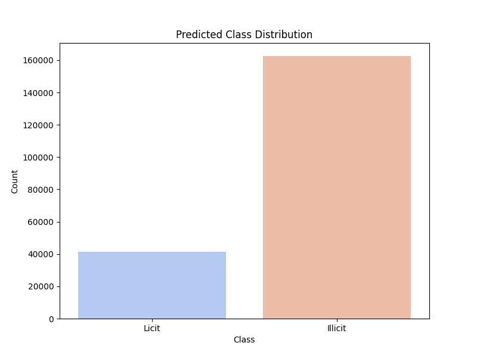


We evaluated the model's performance on the test set using F1 metric:
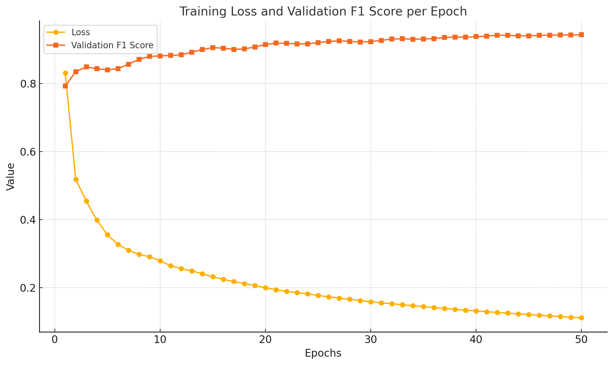


---

## Key Visualizations

### 1. Transaction Class Distribution
   - Displays the proportion of licit, illicit, and unknown transactions.
   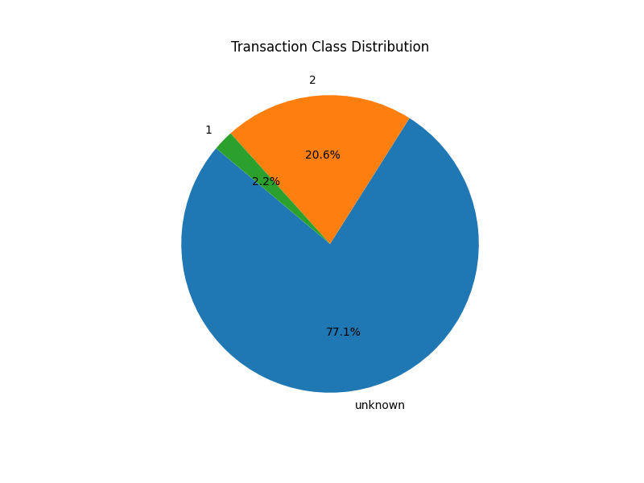

### 2. Temporal Analysis
   - Highlights transaction trends over time.
   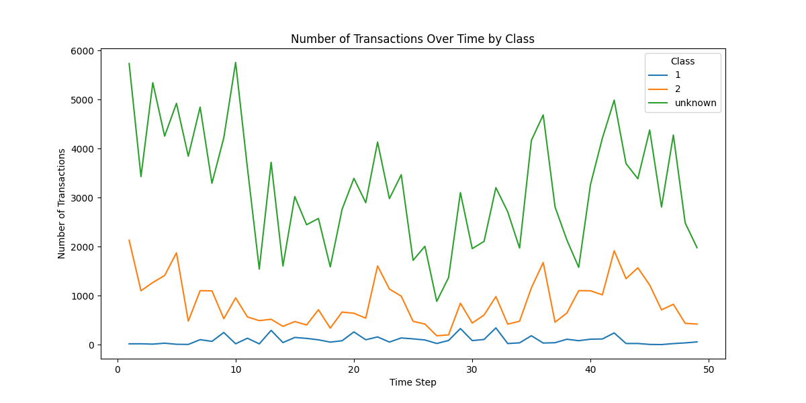

### 3. Node Degree Distribution
   - Examines connectivity levels within the transaction graph.
   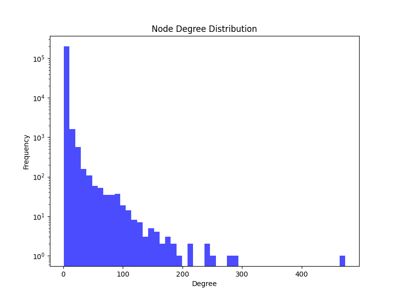

### 4. Feature Correlation Heatmap
   - Analyzes relationships between features.
   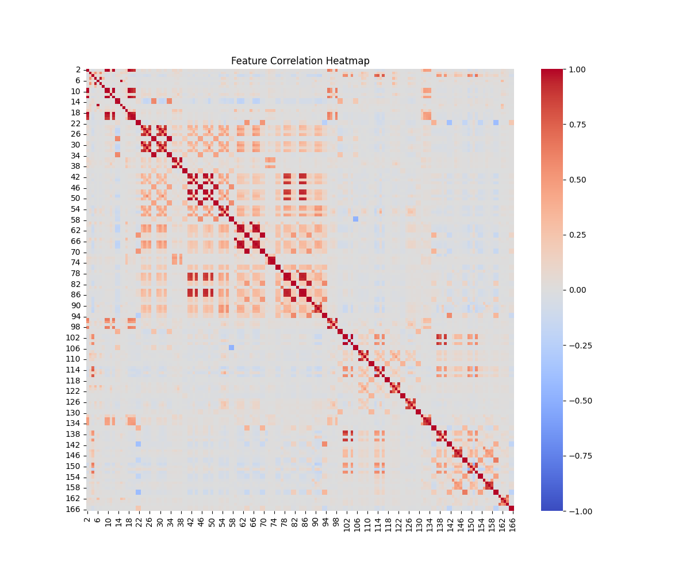

### 5. PCA of Features
   - Reduces high-dimensional features to 2D for easier visualization.
   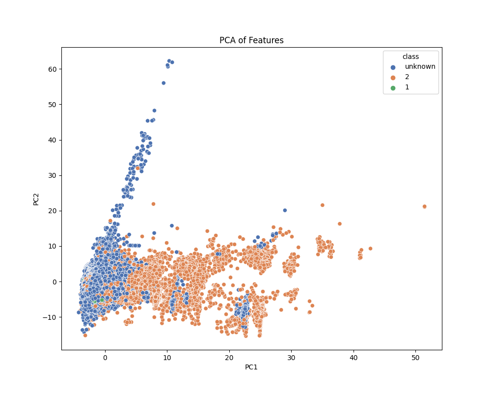

### 6. Node Embeddings
   - Visualizes learned node embeddings to reveal separations between classes.
   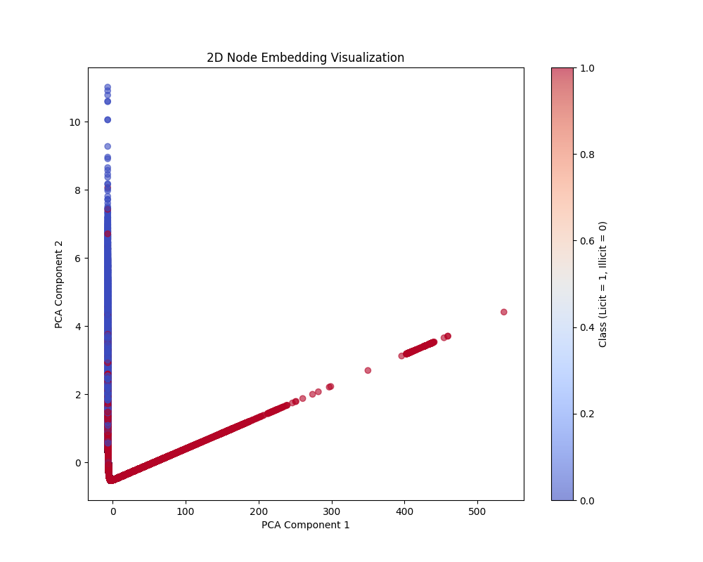

### 7. Prediction Scores Heatmap
   - Displays model confidence in classifying transactions.
   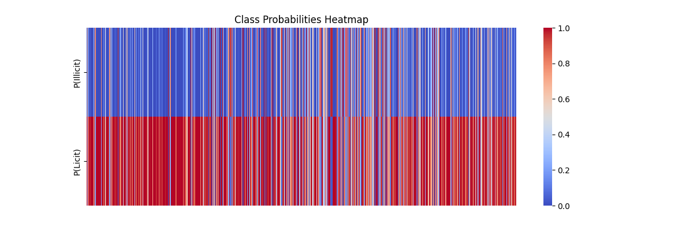

---

## Conclusions
This framework demonstrates the potential of Graph Machine Learning techniques in detecting illicit Bitcoin transactions. The GraphSAGE model effectively learns from graph structures and node features, offering a scalable and robust approach.

### Future Work
- Incorporating more transaction metadata for richer features.
- Real-time deployment to flag suspicious transactions dynamically.
- Applying explainability techniques to interpret model predictions.
