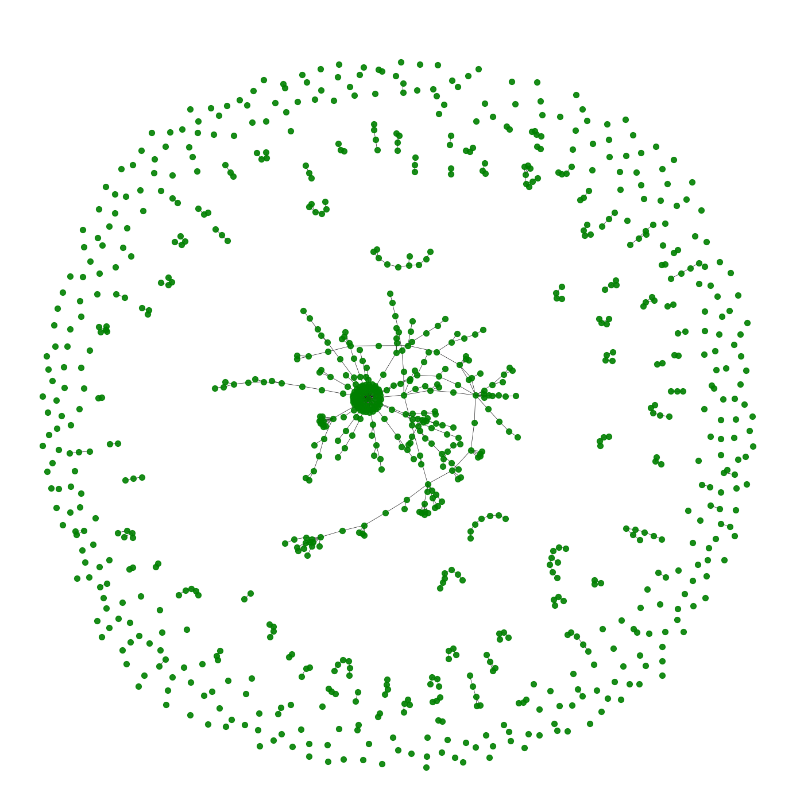

# Fraudulent Bitcoin Transaction Detection Using Graph Machine Learning Techniques

## Table of Contents

1. [Introduction](#introduction)
2. [Dataset Overview](#dataset-overview)
    - [Transaction Class Distribution](#transaction-class-distribution)
    - [Temporal Analysis](#temporal-analysis)
3. [Graph Structure Analysis](#graph-structure-analysis)
    - [Transaction Network Visualization](#transaction-network-visualization)
    - [Node Degree Distribution](#node-degree-distribution)
4. [Feature Analysis](#feature-analysis)
    - [Feature Correlation Heatmap](#feature-correlation-heatmap)
    - [PCA of Features](#pca-of-features)
5. [GraphSAGE Model](#graphsage-model)
    - [Model Workflow](#model-workflow)
    - [Layer Aggregation](#layer-aggregation)
6. [Results and Analysis](#results-and-analysis)
    - [Node Embedding Visualization](#node-embedding-visualization)
    - [Prediction Scores Heatmap](#prediction-scores-heatmap)
7. [Conclusion and Future Work](#conclusion-and-future-work)

---

## Introduction

Bitcoin has revolutionized the financial sector by introducing decentralized digital transactions. However, it has also become a target for fraudulent activities, such as money laundering and illegal trades. Detecting fraudulent transactions in a Bitcoin network poses unique challenges due to its anonymous and decentralized nature.

This project addresses these challenges by leveraging Graph Machine Learning (ML) techniques, particularly the GraphSAGE model, to classify transactions as licit or illicit. By utilizing graph structures and node features, the project provides a robust way to identify suspicious activity in transaction networks.

---

## Dataset Overview

The Elliptic Bitcoin Dataset forms the backbone of this project. It consists of over 200,000 Bitcoin transactions represented as a directed graph. Each transaction is labeled as:
- **Licit**: Normal transactions.
- **Illicit**: Fraudulent transactions.
- **Unknown**: Transactions with no label.

---

### Transaction Class Distribution

Analyzing the class distribution is the first step in understanding the dataset. An imbalanced dataset can pose challenges for model performance and requires careful handling.

**Visualization**:


**Code**:
```python
# Load and analyze class distribution
import pandas as pd
import matplotlib.pyplot as plt

classes_df = pd.read_csv('elliptic_txs_classes.csv')
class_counts = classes_df['class'].value_counts()

# Visualize class distribution
plt.figure(figsize=(8, 6))
plt.pie(class_counts, labels=class_counts.index, autopct='%1.1f%%', startangle=140)
plt.title("Transaction Class Distribution")
plt.show()
```

**Explanation**:
This pie chart visualizes the proportions of licit, illicit, and unknown transactions. The imbalance in class labels highlights the challenge of identifying fraudulent transactions within a sea of legitimate activity.

---

### Temporal Analysis

Temporal analysis reveals how transactions occur over time. Fraudulent transactions may exhibit bursts or spikes at specific intervals.

**Visualization**:


**Code**:
```python
# Analyze temporal trends
features_df = pd.read_csv('elliptic_txs_features.csv', header=None)
features_df = features_df.rename(columns={0: 'tx_id', 1: 'time_step'})
merged_df = pd.merge(features_df[['tx_id', 'time_step']], classes_df, left_on='tx_id', right_on='txId')

# Group by time step and visualize
time_class_counts = merged_df.groupby(['time_step', 'class']).size().unstack(fill_value=0)
time_class_counts.plot(kind='line', figsize=(12, 6))
plt.title('Number of Transactions Over Time by Class')
plt.xlabel('Time Step')
plt.ylabel('Number of Transactions')
plt.legend(title='Class')
plt.show()
```

**Explanation**:
The line plot shows transaction trends over time, with peaks indicating bursts of illicit activity. This analysis is crucial for identifying patterns and unusual behaviors in the data.

---

## Graph Structure Analysis

### Transaction Network Visualization

Bitcoin transactions can be visualized as a graph where nodes are transactions and edges represent links between them. This graph reveals connectivity patterns, which may help identify fraud rings (we take the period of timestep 10 for the visualisation):

**Visualization of illicit ones**:


**Visualization of licit ones**:


**Visualization of both on one**:


**Code**:
```python
import networkx as nx

# Create and visualize the transaction graph
edges_df = pd.read_csv('elliptic_txs_edgelist.csv')
G = nx.from_pandas_edgelist(edges_df, source='txId1', target='txId2')

plt.figure(figsize=(12, 12))
nx.draw(G, node_color="lightblue", node_size=10, alpha=0.7)
plt.title("Transaction Network")
plt.show()
```

**Explanation**:
The network graph highlights clusters of connected transactions. Dense clusters may represent fraud rings or legitimate hubs.

---

### Node Degree Distribution

The degree of a node indicates its level of connectivity. Unusually high-degree nodes may represent central hubs in the transaction network.

**Visualization**:


**Code**:
```python
# Calculate and visualize node degrees
degrees = [val for (node, val) in G.degree()]
plt.figure(figsize=(8, 6))
plt.hist(degrees, bins=50, color='blue', alpha=0.7)
plt.title("Node Degree Distribution")
plt.xlabel("Degree")
plt.ylabel("Frequency")
plt.yscale('log')
plt.show()
```

**Explanation**:
The histogram shows the degree distribution, with most nodes having low degrees. Nodes with high degrees may indicate central roles in the network.

---

## Feature Analysis

### Feature Correlation Heatmap

**Visualization**:


**Code**:
```python
import seaborn as sns

# Compute and visualize feature correlations
corr_matrix = features_df.iloc[:, 2:].corr()
plt.figure(figsize=(12, 10))
sns.heatmap(corr_matrix, cmap='coolwarm', vmin=-1, vmax=1)
plt.title("Feature Correlation Heatmap")
plt.show()
```

**Explanation**:
The heatmap shows relationships between features. Strong correlations may indicate redundancy, while weak correlations suggest unique information for classification.

---

### PCA of Features

**Visualization**:


**Code**:
```python
from sklearn.decomposition import PCA
from sklearn.preprocessing import StandardScaler

# Apply PCA and visualize
features_scaled = StandardScaler().fit_transform(features_df.iloc[:, 2:])
pca = PCA(n_components=2)
principal_components = pca.fit_transform(features_scaled)
pca_df = pd.DataFrame(data=principal_components, columns=['PC1', 'PC2'])
pca_df['class'] = classes_df['class']

sns.scatterplot(data=pca_df, x='PC1', y='PC2', hue='class', palette="deep")
plt.title("PCA of Features")
plt.show()
```

**Explanation**:
The PCA plot reduces the dimensionality of features to 2D, making it easier to visualize clusters of transactions. Clear separations suggest the features are effective for classification.

---

## Results and Analysis

### Node Embedding Visualization

Node embeddings generated by GraphSAGE can be visualized to show separations between licit and illicit transactions.

**Visualization**:


**Code**:
```python
# Visualize embeddings in 2D
pca = PCA(n_components=2)
reduced_embeddings = pca.fit_transform(node_embeddings)
plt.scatter(reduced_embeddings[:, 0], reduced_embeddings[:, 1], c=labels, cmap="coolwarm", alpha=0.6)
plt.title("2D Node Embeddings")
plt.show()
```

---

### Prediction Scores Heatmap

The heatmap of prediction scores provides insights into the model's confidence in classifying each transaction.

**Visualization**:


**Code**:
```python
# Simulate and visualize prediction scores
sns.heatmap([node_scores], cmap="coolwarm", xticklabels=False)
plt.title("Prediction Scores Heatmap")
plt.show()
```

---

## Conclusion and Future Work

This project demonstrates the effectiveness of Graph Machine Learning techniques, specifically GraphSAGE, for detecting fraudulent Bitcoin transactions. Future work could focus on:
- Expanding the dataset to improve generalization.
- Incorporating explainability methods for regulatory compliance.
- Adapting the model for real-time fraud detection.
